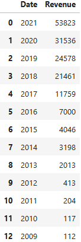
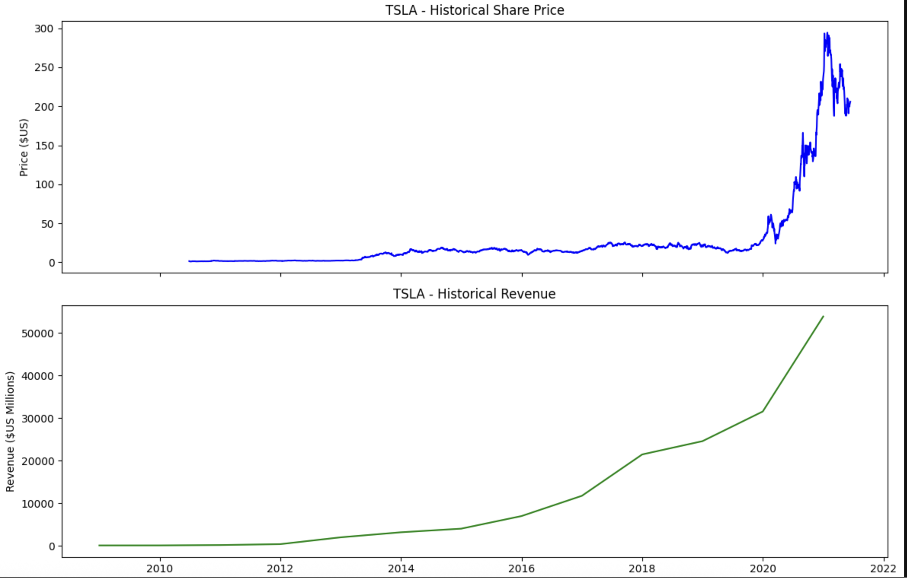
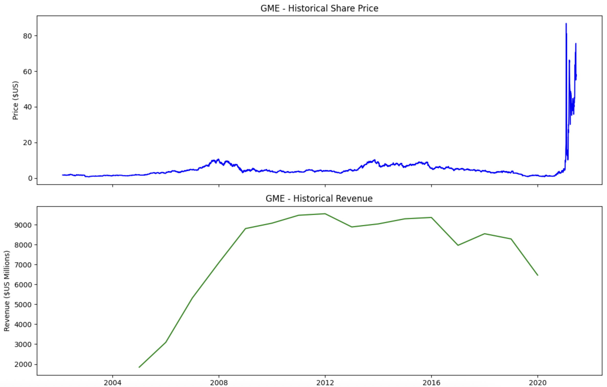

# YahooFinance


## Library Used:
- yfinance
- pandas
- requests
- BeautifulSoup
- matplotlib

## Web Scraping Source:
- [Tesla Revenue 2010-2022](https://cf-courses-data.s3.us.cloud-object-storage.appdomain.cloud/IBMDeveloperSkillsNetwork-PY0220EN-SkillsNetwork/labs/project/revenue.htm)
- [GameStop (GME) Revenue 2006-2020](https://cf-courses-data.s3.us.cloud-object-storage.appdomain.cloud/IBMDeveloperSkillsNetwork-PY0220EN-SkillsNetwork/labs/project/stock.html)

## Stock Data Extraction
``` python
tsla = yf.Ticker('TSLA') # Ticker symbol
tesla_data = tsla.history(period='max') # Specify the period to be 'max'
```


## Revenue Data Scraping
``` python
url = 'https://cf-courses-data.s3.us.cloud-object-storage.appdomain.cloud/IBMDeveloperSkillsNetwork-PY0220EN-SkillsNetwork/labs/project/revenue.htm'

html_data = requests.get(url).text
soup = BeautifulSoup(html_data, 'html.parser')
```
``` python
# Lists created to build the dataframe
date = []
rev = []

for row in soup.find('tbody').find_all('tr'):
  col = row.find_all('td')
  Date = col[0].text
  Revenue = col[1].text
  date.append(Date)
  rev.append(Revenue)

data = {
    'Date': date,
    'Revenue': rev
}

tesla_revenue = pd.DataFrame.from_dict(data)

# Replace the symbols e.g. white space, $ also drop na
tesla_revenue["Revenue"] = tesla_revenue['Revenue'].str.replace(',|$',"",regex=True)
tesla_revenue.dropna(inplace=True)
tesla_revenue = tesla_revenue[tesla_revenue['Revenue'] != ""]
```


## Tesla Graph - Share Price & Revenue


## GME Graph - Share Price & Revenue

